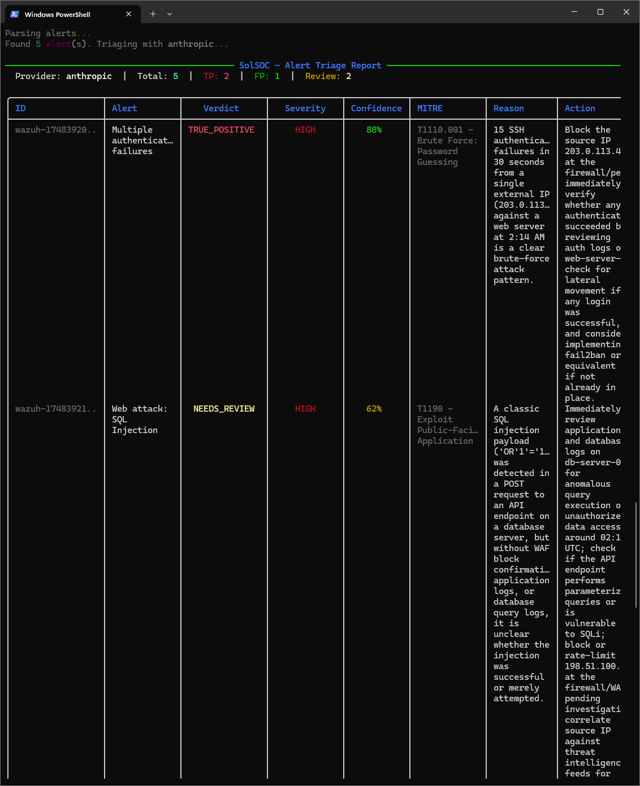
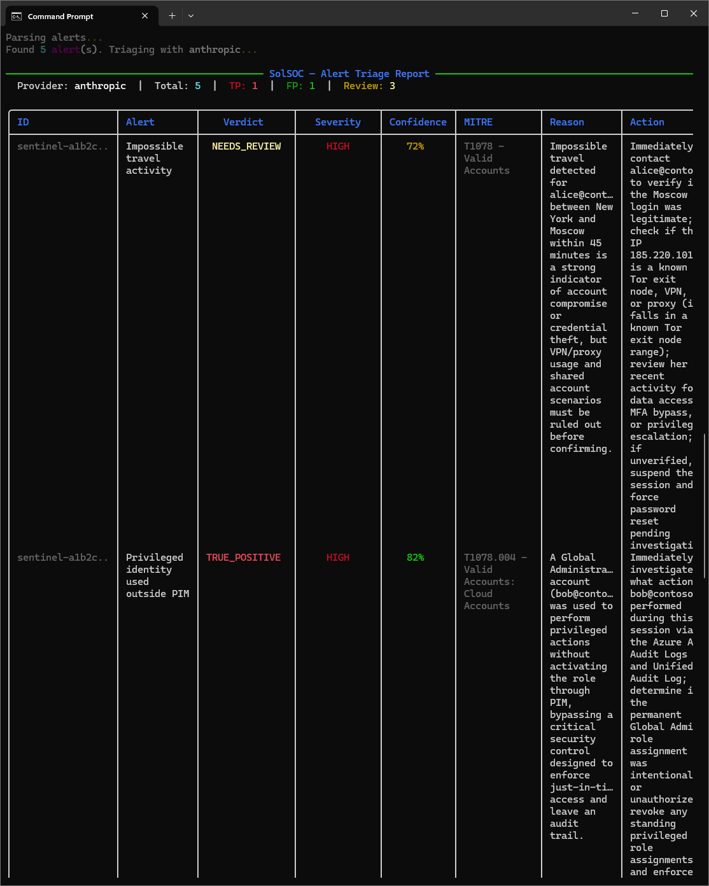
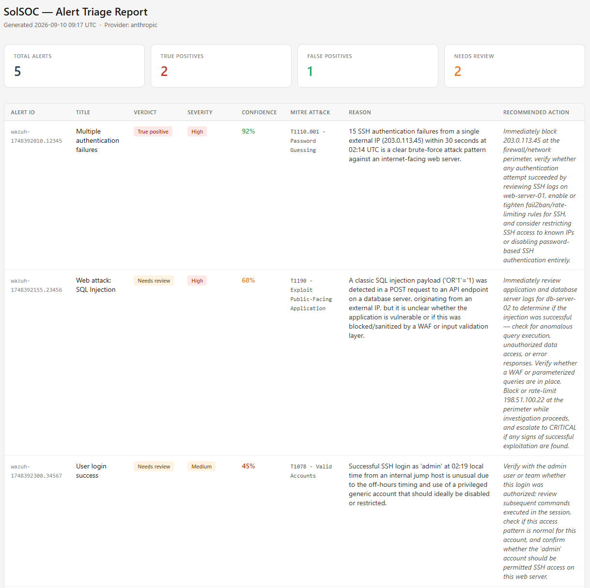

<p align="center">
  
</p>

**AI-powered SOC alert triage. Cut through the noise, surface what matters.**


SolSOC is an open-source CLI that takes a batch of SIEM alerts, sends each one to an LLM of your choice, and returns a structured verdict: **TRUE_POSITIVE**, **FALSE_POSITIVE**, or **NEEDS_REVIEW** — with a severity assessment, a one-line reason, and a recommended next action.

No vendor lock-in. No enterprise license. You bring your own API key.

---

## The problem

SOC analysts face hundreds of alerts every shift. Most are false positives or low-value noise. Manually triaging each one is slow, repetitive, and exhausting — and it's exactly the kind of work that causes real threats to slip through.

Enterprise SIEMs like Splunk ES Premier and Microsoft Sentinel now ship AI triage agents — but they cost thousands per month and are locked to their own ecosystems.

SolSOC brings the same capability to any team, for free, regardless of which SIEM they use.

---

## Features

| Feature | Description |
|---|---|
| 🔍 Auto-detects format | Supports JSON and CSV — no flags needed for common exports |
| 🏢 Multi-SIEM | Works with Wazuh, Splunk, Microsoft Sentinel, or any generic export |
| 🔌 Direct SIEM pull | `solsoc pull wazuh/sentinel/splunk` — fetch, triage, and report in one command |
| 🤖 Multi-LLM | OpenAI, Anthropic (Claude), and Google Gemini — configurable per run |
| 📊 Structured verdicts | TRUE_POSITIVE / FALSE_POSITIVE / NEEDS_REVIEW with severity + reason + action |
| 🎯 MITRE ATT&CK mapping | Each alert is mapped to the most specific ATT&CK technique |
| 📈 Confidence score | 0–100% confidence per verdict, color-coded in terminal output |
| 🖥️ Rich terminal output | Color-coded table with summary stats and progress bar |
| 📄 JSON export | Machine-readable output for piping into scripts or SOAR playbooks |
| 🌐 HTML report | Shareable visual report for your team or manager (`--format html`) |
| 📦 Batch control | `--batch N` limits API calls per batch to avoid rate-limit bursts |
| 📥 stdin support | Pipe alerts directly: `cat alerts.json \| solsoc triage -` |

---

## Quick start

```bash
pip install solsoc
```

Set your API key:

```bash
cp .env.example .env
# Edit .env and add your key
```

Run triage:

```bash
solsoc triage alerts.json
```

That's it.

---

## Installation

### From PyPI (recommended)

```bash
pip install solsoc
```

### From source

```bash
git clone https://github.com/luis-troccoli/solsoc.git
cd solsoc
pip install -e .
```

---

## Configuration

Copy `.env.example` to `.env` and add at least one API key:

```env
ANTHROPIC_API_KEY="your_anthropic_key_here"
OPENAI_API_KEY="your_openai_key_here"
GEMINI_API_KEY="your_gemini_key_here"
```

Get your keys here:
- Anthropic: https://console.anthropic.com
- OpenAI: https://platform.openai.com
- Google Gemini: https://aistudio.google.com

---

## Usage

### Basic triage

```bash
# Triage a JSON file (auto-detects format)
solsoc triage alerts.json

# Triage a CSV export from Splunk
solsoc triage splunk_export.csv

# Read from stdin
cat alerts.json | solsoc triage -
```

### Choose your LLM

```bash
solsoc triage alerts.json --provider anthropic   # default
solsoc triage alerts.json --provider openai
solsoc triage alerts.json --provider gemini
```

### Export results

```bash
# Print JSON to stdout
solsoc triage alerts.json --format json

# Save JSON to file
solsoc triage alerts.json --format json --output results.json

# Save HTML report (shareable with your team or manager)
solsoc triage alerts.json --format html --output report.html

# Auto-detect HTML from file extension
solsoc triage alerts.json --output report.html
```

### Control batch size

```bash
# Process 5 alerts per batch (default: 10)
solsoc triage alerts.json --batch 5

# Safest mode — one alert at a time
solsoc triage alerts.json --batch 1
```

### Other

```bash
# Force input format (skip auto-detection)
solsoc triage myfile.txt --input-format json

# Show version
solsoc version

# Help
solsoc triage --help
```

---

## SIEM integrations

Pull alerts directly from your SIEM without exporting files first. SolSOC fetches, normalizes, triages, and reports in one step.

### Wazuh

```bash
# Using env vars (recommended)
# Set WAZUH_URL, WAZUH_USER, WAZUH_PASSWORD in .env
solsoc pull wazuh --limit 100

# Using CLI flags
solsoc pull wazuh --url https://wazuh.example.com:55000 --username wazuh-wui --password secret

# With HTML report
solsoc pull wazuh --url https://wazuh.example.com:55000 --format html --output report.html

# Skip SSL verification (self-signed certs)
solsoc pull wazuh --url https://wazuh.example.com:55000 --no-verify-ssl
```

**Required env vars:** `WAZUH_URL`, `WAZUH_USER`, `WAZUH_PASSWORD`
**Optional:** `WAZUH_VERIFY_SSL` (default: true)

Install: Wazuh integration uses `requests` — already included in the base install.

---

### Microsoft Sentinel

```bash
# Using env vars (recommended)
# Set SENTINEL_SUBSCRIPTION_ID, SENTINEL_RESOURCE_GROUP, SENTINEL_WORKSPACE_NAME in .env
solsoc pull sentinel --limit 50

# Using CLI flags
solsoc pull sentinel \
  --subscription-id your-sub-id \
  --resource-group your-rg \
  --workspace-name your-workspace

# With service principal (for CI/CD — no az CLI session needed)
solsoc pull sentinel \
  --subscription-id your-sub-id \
  --resource-group your-rg \
  --workspace-name your-workspace \
  --tenant-id your-tenant \
  --client-id your-client-id \
  --client-secret your-secret
```

**Required env vars:** `SENTINEL_SUBSCRIPTION_ID`, `SENTINEL_RESOURCE_GROUP`, `SENTINEL_WORKSPACE_NAME`
**Optional:** `AZURE_TENANT_ID`, `AZURE_CLIENT_ID`, `AZURE_CLIENT_SECRET` (falls back to `az login` session if not set)

Install the Azure extras:
```bash
pip install "solsoc[sentinel]"
```

---

### Splunk

```bash
# Using env vars (recommended)
# Set SPLUNK_URL, SPLUNK_USER, SPLUNK_PASSWORD in .env
solsoc pull splunk --limit 100

# Using CLI flags
solsoc pull splunk \
  --url https://splunk.example.com:8089 \
  --username admin \
  --password secret

# With custom SPL query
solsoc pull splunk \
  --url https://splunk.example.com:8089 \
  --query 'search index=security sourcetype=alert severity=high earliest=-1h'

# Skip SSL verification
solsoc pull splunk --url https://splunk.example.com:8089 --no-verify-ssl
```

**Required env vars:** `SPLUNK_URL`, `SPLUNK_USER`, `SPLUNK_PASSWORD`
**Optional:** `SPLUNK_QUERY` (default: searches `index=main` for the last 24h), `SPLUNK_VERIFY_SSL`

Install: Splunk integration uses `requests` — already included in the base install.

---

## Supported input formats

### JSON — generic, Wazuh, Microsoft Sentinel

SolSOC accepts:
- A JSON array of alert objects: `[{...}, {...}]`
- A single JSON alert object: `{...}`
- Microsoft Sentinel format: `{"value": [{...}, {...}]}`

Field names are auto-mapped from common SIEM conventions (`title`, `AlertDisplayName`, `rule.name`, `severity`, `Severity`, `level`, etc.).

### CSV — Splunk, generic

Any CSV with a header row. SolSOC auto-maps common column names:

| Field | Recognized column names |
|---|---|
| Title | `title`, `alertname`, `name`, `rule` |
| Description | `description`, `message`, `details`, `full_log` |
| Severity | `severity`, `level`, `priority`, `risk_level` |
| Timestamp | `timestamp`, `time`, `TimeGenerated`, `date` |
| Source | `source`, `source_system`, `siem`, `origin` |

---

## Output

### Terminal (default)

Wazuh alerts:



Sentinel alerts:



### HTML report

```bash
solsoc triage alerts.json --format html --output report.html
```



### JSON

```json
{
  "total": 5,
  "true_positives": 2,
  "false_positives": 1,
  "needs_review": 2,
  "provider": "anthropic",
  "results": [
    {
      "alert_id": "wazuh-001",
      "alert_title": "Brute force attack detected",
      "verdict": "TRUE_POSITIVE",
      "severity": "HIGH",
      "reason": "15 failed SSH attempts in 30 seconds from an external IP is consistent with a real brute-force attack.",
      "recommended_action": "Block the source IP at the firewall and review authentication logs for any successful logins.",
      "provider": "anthropic",
      "error": null
    }
  ]
}
```

---

## Example files

The `examples/` folder contains ready-to-use sample alert files so you can test SolSOC without needing a real SIEM:

```bash
solsoc triage examples/wazuh_alerts.json
solsoc triage examples/splunk_alerts.csv
solsoc triage examples/sentinel_alerts.json
```

---

## Command reference

### `solsoc triage` — triage alerts from a file or stdin

```
solsoc triage <source> [options]
```

| Argument / Option | Description | Default |
|---|---|---|
| `source` | Path to alert file (JSON or CSV), or `-` for stdin | required |
| `--provider`, `-p` | LLM provider: `anthropic` \| `openai` \| `gemini` | `anthropic` |
| `--format`, `-f` | Output format: `table` \| `json` \| `html` | `table` |
| `--output`, `-o` | Save output to file (`.json` or `.html`) | stdout |
| `--input-format` | Force input format: `json` \| `csv` (skips auto-detect) | auto |
| `--batch`, `-b` | Alerts per batch — lower = safer on rate limits | `10` |

```bash
solsoc triage alerts.json
solsoc triage alerts.csv --provider openai
solsoc triage alerts.json --provider gemini --format html --output report.html
solsoc triage alerts.json --batch 5
cat alerts.json | solsoc triage -
```

---

### `solsoc pull` — pull alerts directly from a SIEM and triage them

```
solsoc pull <siem> [options]
```

| Argument / Option | Description | Default |
|---|---|---|
| `siem` | SIEM to pull from: `wazuh` \| `sentinel` \| `splunk` | required |
| `--provider`, `-p` | LLM provider: `anthropic` \| `openai` \| `gemini` | `anthropic` |
| `--limit`, `-l` | Max number of alerts to pull | `50` |
| `--batch`, `-b` | Alerts per triage batch | `10` |
| `--format`, `-f` | Output format: `table` \| `json` \| `html` | `table` |
| `--output`, `-o` | Save output to file (`.json` or `.html`) | stdout |

**Wazuh-specific options:**

| Option | Description | Env var |
|---|---|---|
| `--url` | Wazuh base URL (e.g. `https://wazuh.example.com:55000`) | `WAZUH_URL` |
| `--username` | API username | `WAZUH_USER` |
| `--password` | API password | `WAZUH_PASSWORD` |
| `--no-verify-ssl` | Skip SSL certificate verification | `WAZUH_VERIFY_SSL=false` |

**Sentinel-specific options:**

| Option | Description | Env var |
|---|---|---|
| `--subscription-id` | Azure subscription ID | `SENTINEL_SUBSCRIPTION_ID` |
| `--resource-group` | Resource group name | `SENTINEL_RESOURCE_GROUP` |
| `--workspace-name` | Log Analytics workspace name | `SENTINEL_WORKSPACE_NAME` |
| `--tenant-id` | Azure tenant ID (service principal) | `AZURE_TENANT_ID` |
| `--client-id` | Service principal client ID | `AZURE_CLIENT_ID` |
| `--client-secret` | Service principal secret | `AZURE_CLIENT_SECRET` |

**Splunk-specific options:**

| Option | Description | Env var |
|---|---|---|
| `--url` | Splunk base URL (e.g. `https://splunk.example.com:8089`) | `SPLUNK_URL` |
| `--username` | Splunk username | `SPLUNK_USER` |
| `--password` | Splunk password | `SPLUNK_PASSWORD` |
| `--query`, `-q` | Custom SPL search query | `SPLUNK_QUERY` |
| `--no-verify-ssl` | Skip SSL certificate verification | `SPLUNK_VERIFY_SSL=false` |

```bash
solsoc pull wazuh --limit 100
solsoc pull wazuh --url https://wazuh.example.com:55000 --username wazuh-wui --password secret
solsoc pull sentinel --subscription-id xxx --resource-group rg --workspace-name ws
solsoc pull splunk --url https://splunk.example.com:8089 --query 'index=security severity=high'
solsoc pull wazuh --format html --output report.html --provider openai
```

---

### `solsoc version` — show installed version

```bash
solsoc version
```

---

## Contributing

Contributions are welcome — bug reports, feature suggestions, and code fixes. Read [`CONTRIBUTING.md`](./CONTRIBUTING.md) before submitting a PR.

By contributing, you agree to the Contributor License Agreement included in [`LICENSE`](./LICENSE).

```bash
git clone https://github.com/luis-troccoli/solsoc.git
cd solsoc
pip install -e ".[dev]"
pytest tests/
```

---

## Cost

SolSOC doesn't charge anything — you pay only for the LLM API calls you make,
billed directly by your provider.

As a reference: triaging 5 alerts with Claude Sonnet (Anthropic) costs roughly
**$0.04 per run** (~$0.008 per alert). A full shift of 50 alerts would cost
around **$0.40**.

Costs vary by provider — Gemini Flash and GPT-4o Mini are significantly cheaper
if budget is a concern. You can also use `--batch 1` to process alerts one at a
time and monitor spend more closely.


---

## License

MIT with Commons Clause — free to use and distribute. You may not sell this software or offer it as a hosted service without explicit written permission from the author.

For commercial licensing inquiries: ltrocc@gmail.com

By contributing to this project, you agree to the Contributor License Agreement in [`LICENSE`](./LICENSE).

---

*Built by [Luis Troccoli](https://github.com/luis-troccoli) — Cloud Security Engineer / DevSecOps.*
*If SolSOC saves you time, give it a ⭐ — it helps others find it.*
